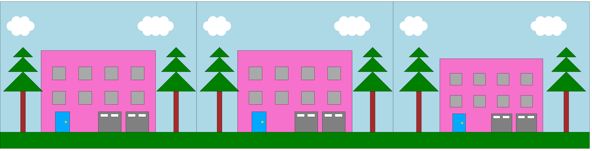

# BIODS253 Project 1
This repository contains the code to draw the following house, the village underneath it, and the post-earthquake village below that.





## Usage 
Start by cloning the repository to your local directory:
```
git clone https://github.com/minwoosun/BIODS253-project1.git
```

Install relevant dependencies by running: 
```
conda env create -f environment.yml
```

## Development 
Code for drawing all components of the house is contained in **house.py**.

To draw the house, please run:
```
python house.py
```

By default, the drawing of the house should look exactly like the screenshot
above.

To draw the pre-earthquake village, please run:
```
python springfield.py
```

Then, select 'B'. By default, the drawing of the village should look exactly like the screenshot
above.

To draw the post-earthquake village, please run:
```
python springfield.py
```

Then, select 'C'. By default, the drawing of the village should look exactly like the screenshot
above.

To test the implementation, please run:
```
python shape_test.py
```
`shape_test.py` contains 10 unit tests that test various elements of the project,
in addition to the project as a whole.
